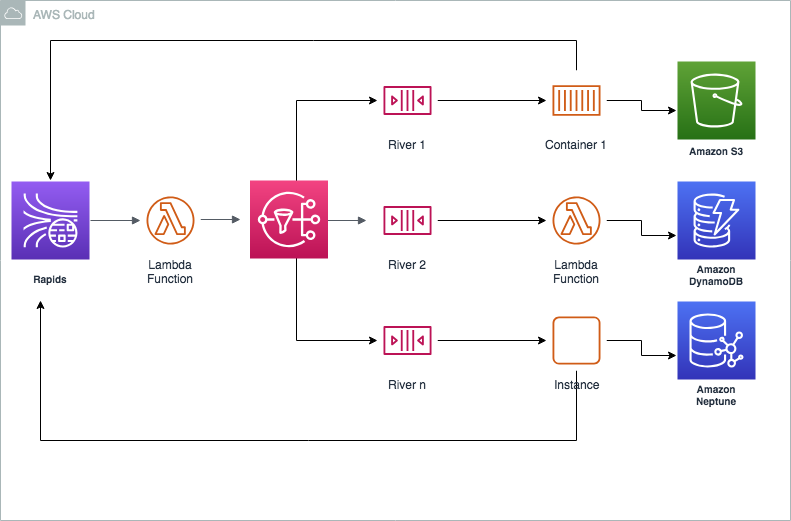

# rapids-rivers-streams

Example implementation of Fred George style microservices architecture

## Overview

This project illustrates one way to implement the rapids, rivers, ponds approad to microservice architecture using AWS technology components.

Here, we'll use Kinesis for our main event bus (rapids). We'll use a simple stream reader to pick off events and publish them to an SNS topic, and use filter topic subscriptions to populate SQS queues (rivers), with services consuming messages from the rivers. Services may persist events or data derived from events or produced by application logic in datastores of choice (ponds).



This project provides a control plane stream used to subscribe rivers to topics and create queues on demand for rivers, a stream for the rivers, and a simple CLI to kick the tires.

Here's a sample CLI session:

```console
lappy:cli ds$ node cmd.js --rapids Rapids-dev --control-stream Control-dev
stage not specified - default to dev
cmd > help

  Commands:

    help [command...]             Provides help for a given command.
    exit                          Exits application.
    send <event> <source> [data]  Publish event with optional data
    subscribe <river> <topic>     Subscribe a river to a topic
    readfrom <river>              Get a batch of messages

cmd > subscribe MyApp ViewPage
cmd > subscribe AnotherApp AnotherEvent
cmd > readfrom MyApp
[]
cmd > send ViewPage TheSource '{"name":"Sally"}'
cmd > readfrom MyApp
[ { eventType: 'ViewPage',
    eventDomain: 'TheSource',
    payload: { name: 'Sally' },
    timestamp: '2019-04-18T22:17:36.352Z',
    eventId: '1f183791-82df-487f-84aa-224c024f79ba' } ]
cmd > readfrom AnotherApp
[]
cmd > 
```

## Event structure

When writing events to the rapids, we need some standard metadata to enable routing events to interested consumers and their associated rivers.

We'll assume a JSON event structure that includes some standard fields:

* eventDomain - Domain of the event emitter. Think of this in terms of business domain
* eventName - Name of the event
* payload - event content
* timestamp - ISO 8601 UTC timestamp
* eventId - uuid


## Deploying Rapids and Rivers

To deploy the rapids and rivers infrastructure:

```console
aws cloudformation create-stack --stack-name rapids-and-rivers-inf \
--template-body file://cfn/rapids-and-rivers-inf.yml \
--parameters ParameterKey=Stage,ParameterValue=dev
```
To deploy the control plane:

```console
cd control-plane
make
```

To deploy the data plane:

```console
cd data-plane
make
```

## CLI

Use the cli to send events and commands.

```console
node cmd.js --rapids Rapids-dev --control-stream Control-dev
cmd >
```

To subscribe to a topic:

```console
subscribe <river> <topic>
```

To send a view page event:

```console
cmd > send ViewPage TheSource '{"name":"Sally"}'
```

## Scenario

In progress...

From the video, we'll ape the travel scenario where Sally views a page, and an offer engine assembles offers based on events consumed and produced by membership, segmentation, location, and brand services.

For this scenario, we'll have rivers for the services and offers engine, and a single rapids. The rapids will be a Kinesis stream, the rivers SQS queues. We'll also have a river for those interested in consuming offers.

The scenario is this:

* An event conveying Sally is looking at a page is emitted.
    * The location and brand services respond to the event with some baseline offer events. 
    * The segmenation service responds to the event by emitting an event stating Sally is a Road Warrior
    * The membership services response by emitting an event stating Sally is a Platinum member
* The location and services emit a new offers based on Sally being a Road Warrior
* The location service emits a new offer based on SAlly being both a Road Warrior and a Platimum member
* The offer engine will buffer offers for some amount of time, then emit offers

## Background

Notes from Fred George's [Implementing Micro Service Architecture talk](https://vimeo.com/79866979)

Microservices are:

* Tiny
* Loosely coupled (including flow)
* Multiple versions simultaneously running ok
* Self-execution monitoring of seach service
* Publish interesting stuff
* "Application" is the wrong concept; think in terms of service and systems

Rapids, Rivers, and Ponds

* Rapids - Every event, implemented as a bus
* Rivers - themed events, services hook in
* Static databases - data warehoses, reporting - ponds

High-Performance Bus

* App events
* Logs
* Service events

Tech components

* Kafka for the bus
* Rapids - Zero MQ, themed queues, can chain them

Services

* Listen to rivers
* Publish to the rapids

Async Services

* Service - expresses a need to the bus
* Other services - willing to respond to that need
* Multiple responses might be available, service expressing need selects solution

This architecture supports experimentation

* Enable experimentation without changing existing code

Design
* Events, not Entities
* History, not Current

Cloud of Signals

* What are the patterns
* Producers, consumers

Observations

* Services become disposable
* Loosely coupled via READful JSON packets or DB
* Self monitoring services replaces unit tests
* Business monitoring replaces acceptance tests
* Services language agnostic

Living Software System

* Long-lived systems, short-lived services (human body, cells)
* Extremely dynamic with continuous deployments
* Accept it is complex (especially for testing)
    * Acceptance test on business outcomes
* Radical impacts to dev processes
* There will be a learning curve